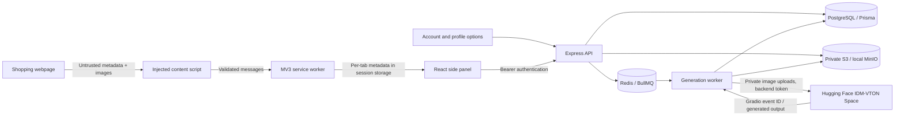

# Architecture



```mermaid
sequenceDiagram
  actor User
  participant Extension
  participant API
  participant DB
  participant Queue
  participant Worker
  participant Storage
  participant Provider
  User->>Extension: Select image, category, variant; consent
  Extension->>API: POST /jobs + idempotency key
  API->>DB: Ownership, readiness, consent; insert queued job
  API->>Queue: Enqueue stable job ID
  API-->>Extension: 202 + job ID
  Queue->>Worker: Process (or recover stalled job)
  Worker->>Storage: Read existing personal reference
  Worker->>Worker: Retrieve product with DNS pinning; decode/normalize
  Worker->>DB: Persist submission intent
  Worker->>Provider: Person + garment, once
  Provider-->>Worker: Prediction ID
  Worker->>DB: Save prediction ID
  loop Until terminal or deadline
    Worker->>Provider: GET prediction status
    Extension->>API: Poll job with backoff
    API-->>Extension: Persisted real lifecycle state
  end
  Worker->>DB: Acquire owner lock and recheck live job
  Worker->>Storage: Write result
  Worker->>DB: Commit completed result
  Extension->>API: Authenticated image request
  API-->>Extension: Private image bytes
```

## Boundaries

`packages/shared` contains schemas, extraction, and the category registry. `apps/extension` has three React entry pages, injected content script and suspension-safe coordination worker. `apps/api` owns authentication, per-resource ownership, media access and durable job creation. `apps/worker` owns external image retrieval, provider calls, reconciliation and cleanup. The database migration is committed under `prisma/migrations`.

The app uses the mature Prisma 6 interface, intentionally pinned by major, rather than mixing incompatible Prisma 7/8 setup conventions. Vite 7, React 19 and Tailwind 4 are locked in `package-lock.json`. The dependency override patches Prisma's CLI-only deep-merge library; migration/generation checks exercise that override. `.npmrc` works around npm 10's optional-peer resolver crash encountered with Vitest's peer graph.

## Durable execution

The database is authoritative. Queue entries contain only the job ID. A 15-second reconciler redispatches nonterminal database jobs missing from Redis. Redis AOF preserves queue state. BullMQ stall recovery reruns the processor, which reuses persisted input objects, intermediate output and provider prediction IDs.

A unique `(userId, idempotencyKey)` constraint, an owner transaction lock, and a payload hash prevent duplicate clicks or a reused key with different inputs. The UI retains a request key for ambiguous retries in the same draft; the backend finds running jobs when the panel is reopened. Queue/provider submissions are not retried indiscriminately. A crash after submission intent but before a saved prediction ID produces `SUBMISSION_UNCERTAIN`; the operator must inspect provider history before a new paid request. This trades automatic completion for avoiding duplicate billing.

Status GET failures retry with bounded exponential backoff. Provider status polling has a 20-minute job deadline. No percentages are fabricated. A lifestyle job stays `generating` while its second prediction runs. The UI can close without cancelling server work. No callbacks are exposed; repeated polling is safe.

Cancellation is local, because no provider cancellation endpoint was established in the referenced contract. Completed external work is discarded if the local job is no longer active. Failed and cancelled intermediates enter garbage cleanup.

## Deletion invariant

Personal-data mutations, upload publication, and result publication serialize with `pg_advisory_xact_lock(hashtextextended(userId, 0))`. A transaction rechecks the user and live job before saving. Deletion atomically records every object key in a garbage outbox and removes rows and access paths. A worker cannot recreate rows after the parent/user/job is gone. Photo replacement cancels affected active jobs; completed results keep their immutable original snapshot for accurate comparison.

Each new object is first registered in the garbage outbox. Successful publication removes that entry in its DB transaction. If a write or transaction fails, the object remains eligible for collection. Cleanup waits two minutes, runs every 15 seconds, and retries storage failures. Storage requests have timeouts. No temporary personal images are written to disk.

## Extraction

Layers: JSON-LD (arrays, nested graph), microdata, generic cards/semantic anchors, Open Graph/page metadata. Each product retains its own image candidates. Candidate signals include decoded/rendered dimensions when available, gallery placement, lazy-source and srcset alternatives. This ranking does not identify a semantic viewing angle. Variants with known image associations may select that image; other variants require visual confirmation.

Mutation observation is debounced and throttled, scans are bounded, old observers are removed on reinjection, and URL changes trigger another scan. The original selection remains a draft while another tab is viewed. Re-detect to update it. ActiveTab permission expires on some navigation; the toolbar gesture renews it. Unsupported browser pages give an actionable error. Manual picking only reads the selected visible page image and can be cancelled with Escape.

Limitations: closed shadow roots, inaccessible iframes, CSS-only imagery, unusual cards and virtualized listings may require manual picking. Listing results are capped at 60 and image candidates at 40. The last 100 jobs are exposed in this assignment UI. Provider output realism is not guaranteed.
